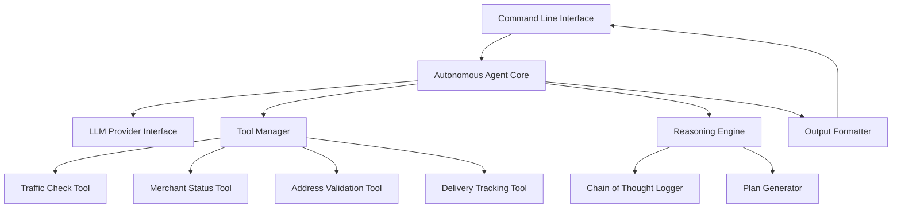

# Design Document

## Overview

The Autonomous Delivery Coordinator is designed as a reasoning agent that combines Large Language Model (LLM) capabilities with structured tool usage to resolve delivery disruptions. The system follows a ReAct (Reasoning + Acting) pattern, where the agent iteratively reasons about problems, takes actions using available tools, and observes results to inform subsequent decisions.

The architecture emphasizes transparency through detailed chain-of-thought logging, modularity through clear separation of concerns, and extensibility through a plugin-based tool system.

## Architecture



### Core Components

1. **Autonomous Agent Core**: Orchestrates the reasoning loop and coordinates between all components
2. **LLM Provider Interface**: Abstracts communication with language model APIs (OpenAI, Anthropic, etc.)
3. **Tool Manager**: Manages available tools and handles tool execution
4. **Reasoning Engine**: Implements the ReAct pattern and maintains reasoning state
5. **Chain of Thought Logger**: Records and formats the agent's reasoning process
6. **Plan Generator**: Creates structured resolution plans from reasoning outcomes
7. **Output Formatter**: Formats results for command-line display

## Components and Interfaces

### Agent Core Interface

```python
class AutonomousAgent:
    def process_scenario(self, scenario: str) -> ResolutionResult:
        """Main entry point for processing disruption scenarios"""
        
    def _reasoning_loop(self, scenario: str) -> ReasoningTrace:
        """Implements the ReAct reasoning pattern"""
        
    def _should_continue_reasoning(self, trace: ReasoningTrace) -> bool:
        """Determines if more reasoning steps are needed"""
```

### Tool Manager Interface

```python
class ToolManager:
    def get_available_tools(self) -> List[Tool]:
        """Returns list of available tools for the agent"""
        
    def execute_tool(self, tool_name: str, parameters: Dict) -> ToolResult:
        """Executes a specific tool with given parameters"""
        
    def register_tool(self, tool: Tool) -> None:
        """Registers a new tool with the manager"""
```

### Reasoning Engine Interface

```python
class ReasoningEngine:
    def generate_reasoning_step(self, context: ReasoningContext) -> ReasoningStep:
        """Generates next reasoning step based on current context"""
        
    def evaluate_tool_results(self, results: List[ToolResult]) -> Evaluation:
        """Evaluates tool results and updates reasoning context"""
        
    def generate_final_plan(self, trace: ReasoningTrace) -> ResolutionPlan:
        """Creates final resolution plan from reasoning trace"""
```

### Simulated Tools Interface

Each tool implements a common interface:

```python
class Tool:
    name: str
    description: str
    parameters: Dict[str, Any]
    
    def execute(self, **kwargs) -> ToolResult:
        """Executes the tool with provided parameters"""
        
    def validate_parameters(self, **kwargs) -> bool:
        """Validates input parameters before execution"""
```

## Data Models

### Core Data Structures

```python
@dataclass
class DisruptionScenario:
    description: str
    entities: List[Entity]  # Extracted addresses, merchants, delivery IDs
    scenario_type: ScenarioType
    urgency_level: UrgencyLevel

@dataclass
class ReasoningStep:
    step_number: int
    thought: str
    action: Optional[ToolAction]
    observation: Optional[str]
    timestamp: datetime

@dataclass
class ToolResult:
    tool_name: str
    success: bool
    data: Dict[str, Any]
    execution_time: float
    error_message: Optional[str]

@dataclass
class ResolutionPlan:
    steps: List[PlanStep]
    estimated_duration: timedelta
    success_probability: float
    alternatives: List[AlternativePlan]
    stakeholders: List[Stakeholder]

@dataclass
class PlanStep:
    sequence: int
    action: str
    responsible_party: str
    estimated_time: timedelta
    dependencies: List[int]
    success_criteria: str
```

### Entity Recognition Models

```python
@dataclass
class Entity:
    text: str
    entity_type: EntityType  # ADDRESS, MERCHANT, DELIVERY_ID, PERSON
    confidence: float
    normalized_value: Optional[str]

class EntityType(Enum):
    ADDRESS = "address"
    MERCHANT = "merchant"
    DELIVERY_ID = "delivery_id"
    PERSON = "person"
    PHONE_NUMBER = "phone"
    TIME = "time"
```

## Error Handling

### Error Categories

1. **LLM API Errors**: Rate limiting, authentication, service unavailability
2. **Tool Execution Errors**: Network timeouts, invalid parameters, service failures
3. **Parsing Errors**: Malformed input, entity extraction failures
4. **Reasoning Errors**: Infinite loops, contradictory information, insufficient data

### Error Handling Strategy

```python
class ErrorHandler:
    def handle_llm_error(self, error: LLMError) -> ErrorResponse:
        """Implements retry logic with exponential backoff"""
        
    def handle_tool_error(self, error: ToolError) -> ErrorResponse:
        """Attempts alternative tools or graceful degradation"""
        
    def handle_reasoning_error(self, error: ReasoningError) -> ErrorResponse:
        """Provides fallback reasoning strategies"""
```

### Graceful Degradation

- When primary tools fail, attempt alternative information sources
- When LLM is unavailable, use rule-based fallback for common scenarios
- When reasoning becomes circular, implement circuit breakers
- Provide partial solutions when complete resolution isn't possible

## Testing Strategy

### Unit Testing

- **Tool Testing**: Mock external APIs and test tool logic independently
- **Reasoning Testing**: Test reasoning steps with predefined scenarios
- **Entity Extraction**: Test entity recognition with various input formats
- **Plan Generation**: Verify plan structure and logical consistency

### Integration Testing

- **End-to-End Scenarios**: Test complete workflow with realistic disruption scenarios
- **Tool Chain Testing**: Verify tools work together correctly
- **Error Recovery Testing**: Test system behavior under various failure conditions
- **Performance Testing**: Measure response times and resource usage

### Test Scenarios

1. **Traffic Disruption**: Road closure requiring route recalculation
2. **Merchant Unavailability**: Restaurant closed, need alternative or rescheduling
3. **Address Issues**: Incorrect or incomplete delivery address
4. **Multi-Factor Disruption**: Combination of traffic, merchant, and address problems
5. **Edge Cases**: Malformed input, tool failures, contradictory information

### Testing Framework

```python
class ScenarioTester:
    def test_scenario(self, scenario: str, expected_outcome: ExpectedOutcome) -> TestResult:
        """Tests agent performance on specific scenarios"""
        
    def evaluate_reasoning_quality(self, trace: ReasoningTrace) -> ReasoningQuality:
        """Evaluates the logical consistency of reasoning"""
        
    def measure_tool_usage_efficiency(self, trace: ReasoningTrace) -> EfficiencyMetrics:
        """Measures how efficiently tools were used"""
```

### Evaluation Metrics

- **Resolution Success Rate**: Percentage of scenarios successfully resolved
- **Reasoning Quality**: Logical consistency and coherence of thought process
- **Tool Usage Efficiency**: Appropriate tool selection and minimal redundant calls
- **Response Time**: Time from input to final resolution plan
- **Plan Actionability**: Whether generated plans can be realistically executed

## Implementation Considerations

### LLM Integration

- Support multiple LLM providers (OpenAI GPT-4, Anthropic Claude, etc.)
- Implement prompt engineering best practices for reasoning tasks
- Use structured output formats to ensure consistent tool calling
- Implement token usage optimization to manage API costs

### Tool Simulation

Tools will simulate realistic logistics APIs with:
- Realistic response times and occasional failures
- Structured data formats matching real-world APIs
- Configurable scenarios for testing different conditions
- Logging capabilities for debugging and analysis

### Extensibility

- Plugin architecture for adding new tools
- Configurable reasoning strategies
- Customizable output formats
- Support for different LLM providers and models

### Performance Optimization

- Implement caching for repeated tool calls
- Use async/await for concurrent tool execution
- Optimize prompt sizes to reduce LLM latency
- Implement request batching where possible